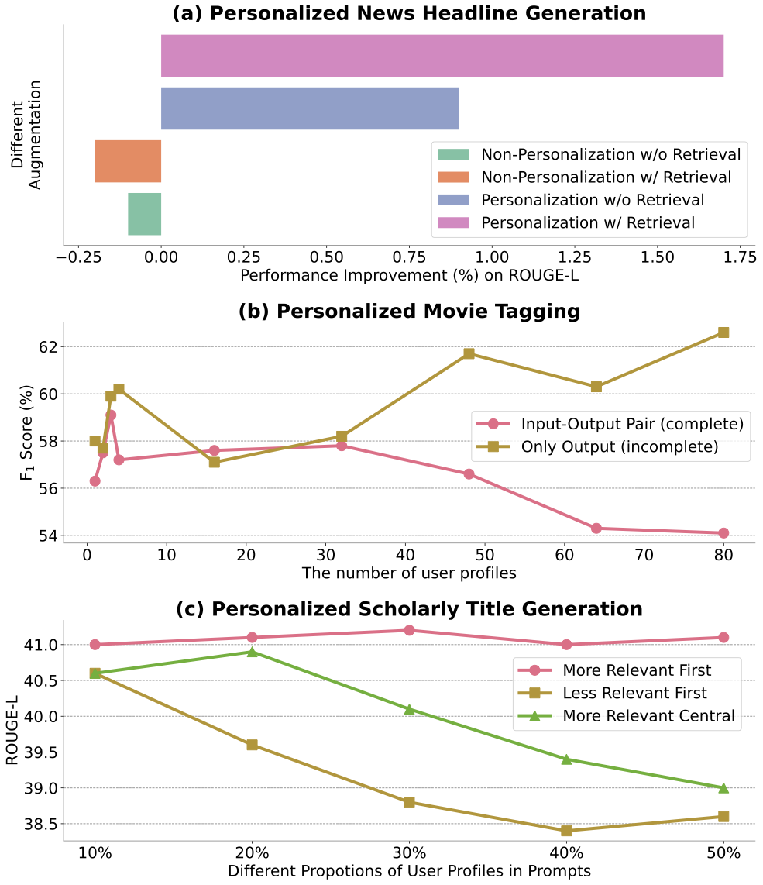

# Understanding the Role of User Profile in the Personalization of Large Language Models
This repository provides the code for our paper titled **[Understanding the Role of User Profile in the Personalization of Large Language Models]()**, making the integration of our code contributions into other projects more accessible.

<div align="center">

  []()
  [](https://pytorch.org/)
  [](https://opensource.org/licenses/MIT)
</div>


<p align="center">
  </a>
  <br />
  <em>Our key findings: (a) Semantic information is less critical to the effectiveness of user profile than personalization, and it only contributes when built on top of personalization (<ins>The Top Figure</ins>); (b) The impact of user responses on personalization is greater than that of previous input and their mapping between users' previous input and response (<ins>The Middle Figure</ins>); (c) The user profiles in the different positions of the context contribute differently to the personalization, where profiles positioned closer to the beginning contribute more (<ins>The Bottom Figure</ins>).</em>
</p>

## Overview
You can reproduce the experiments of our paper [Understanding the Role of User Profile in the Personalization of Large Language Models]().

> **Abstract**
> Utilizing user profiles to personalize Large Language Models (LLMs) has been shown to enhance the performance on a wide range of tasks. However, the precise role of user profiles and their effect mechanism on LLMs remains unclear. This study first confirms that the effectiveness of user profiles is primarily due to personalization information rather than semantic information. Furthermore, we investigate how user profiles affect the personalization of LLMs. Within the user profile, we reveal that it is the historical personalized response produced or approved by users that plays a pivotal role in personalizing LLMs. This discovery unlocks the potential of LLMs to incorporate a greater number of user profiles within the constraints of limited input length. As for the position of user profiles, we observe that user profiles integrated into different positions of the input context do not contribute equally to personalization. Instead, where the user profile that is closer to the beginning affects more on the personalization of LLMs. Our findings reveal the role of user profiles for the personalization of LLMs, and showcase how incorporating user profiles impacts performance providing insight to leverage user profiles effectively.
> 

## 1. Requirements and Installation
To install the required packages for our baseline approaches (semi-supervised approaches), you can run the following command.
```sh
conda create -n <env_name> python=3.11
conda activate <env_name>
pip install -r requirements.txt
```

## 2. Dataset
We conduct the experiments on LaMP dataset ([Salemi
et al., 2023](https://arxiv.org/pdf/2304.11406)), which can be download [here](https://lamp-benchmark.github.io/download). Note that LaMP-6 is not publicly available, and it is skipped in the paper and code.

Note that when running the scirpt, please set the '--raw_data_folder_path \<the path to the LaMP Folde\r>', such as '\<the path\>/LaMP'.

## 3. Training
To reproduce the analysis of the paper, you can run the following script.

```
python train.py \
    --task_name ${TASK_NAME} \
    --task_pattern 'user-based' \
    --retrieval_id ${RETRIEVAL_ID} \
    --retrieval_num ${RETRIEVAL_NUM} \
    --training_epoch ${TRAINING_EPOCH} \
```

The introduction for the input arguments
|Name|Type|Help|Choices|
|-|-|-|-|
|task_name|str|the name of the task for fine-tuning| 'LaMP_1', 'LaMP_2', 'LaMP_3', 'LaMP_4', 'LaMP_5', 'LaMP_6', 'LaMP_7'|
|retrieval_id|str|'the retrieval method for user profiles'|'BM25', 'Random', 'Full_Random', 'Mixed', 'RanBM25'|
|retrieval_ablation|str|'the removal of the input or output'|'only_input', 'only_output', 'both', 'decouple'|
|retrieval_order|str|the order of the retrieved topk user profile|'start', 'end', 'middle', 'random'|

## Bugs or questions?
If you have any questions regarding the code or the paper, please feel free to reach out to Authors at `bin.wu.23@ucl.ac.uk`.  If you experience any difficulties while using the code or need to report a bug, feel free to open an issue. We kindly ask that you provide detailed information about the problem to help us provide effective support.


## Citation
```
```